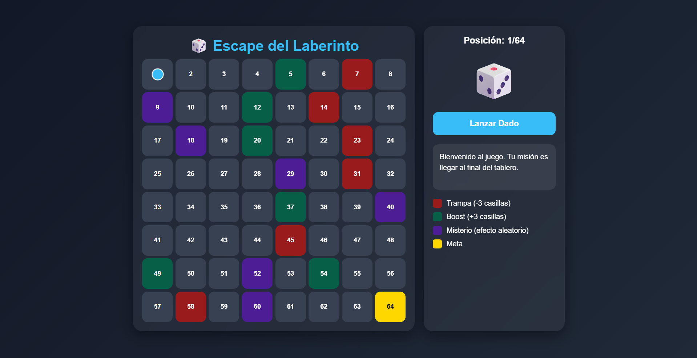

# 🎲 Escape del Laberinto

Un juego de mesa interactivo desarrollado con **HTML, CSS y JavaScript puro**.

El objetivo del juego es llegar al final del tablero evitando trampas, aprovechando boosts y sobreviviendo a las casillas misteriosas.

---

## 🚀 Demo

```bash
https://github.com/JuanC-32/escape-del-laberinto
```

---

## ✨ Características

* 🎲 Sistema de dados aleatorio
* 🧩 Tablero dinámico de 64 casillas
* 💀 Trampas que hacen retroceder
* 🚀 Boosts que permiten avanzar más rápido
* ✨ Casillas misteriosas con efectos aleatorios
* 📱 Diseño responsive
* 🎨 Interfaz moderna y animaciones
* ⚡ Hecho completamente con JavaScript Vanilla

---

## 🛠️ Tecnologías utilizadas

* HTML5
* CSS3
* JavaScript

---

## 📂 Estructura del proyecto

```bash
📁 Escape-del-laberinto
 ├── 📁 assets
 │    ├── 📁 images
 │    │    └── Laberinto.png
 ├── index.html
 ├── styles.css
 ├── script.js
 ├── README.md
```

---

## 🎮 Cómo jugar

1. Presiona el botón "Lanzar Dado"
2. Avanza por el tablero
3. Evita las trampas
4. Aprovecha los boosts
5. Llega a la casilla final para ganar 🏆

---

## 📸 Capturas



---

## 📈 Objetivo del proyecto

Este proyecto fue creado para practicar:

* Manipulación del DOM
* Lógica de programación
* Eventos en JavaScript
* Diseño responsive
* Desarrollo frontend sin frameworks

---

## 🤝 Feedback

Cualquier sugerencia o mejora es bienvenida.

Si te gustó el proyecto, puedes darle una ⭐ al repositorio.

---

## 👨‍💻 Autor

Desarrollado por Juan Camilo Caicedo 🚀
